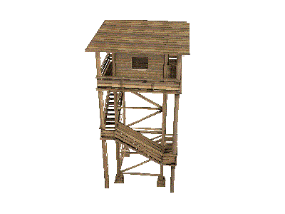

# Rasterizer
Simple (but spaghetti) rasterizer

## Got
- primitive clipping
- hidden surface removal (depth buffering)
- transformation, model, view, projection matrices
- loading .obj model, and associated with it .bmp texture
- "displaying" the rendered content (.ppm file or real-time rendering on a SDL surface)
- back face culling

## Sample


## How to run?

### Packages
Install conan package manager, then:

```
$ mkdir build
$ cd build
$ conan install ..
$ cmake ..
```

### Compiling
```
$ cd build
$ cmake --build . --config Release
```

### Running
```
$ ./build/bin/main
```


